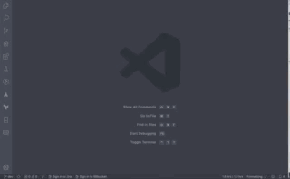

# Open My Calendar

This extention easily allows you to open pre-defined calender urls via the VSCode command palette.

## Features

This extension is active by default when installed.

* `Calendar: Add Calendar` - Add calendar name and url.
* `Calendar: Show All Calendars` - Show all added calendars.
* `Calendar: Open Calendar` - Open calendar.
* `Calendar: Delete Calendar` - Delete calendar.

## Requirements

`valid-url` need to be installed.

## Known Issues

* Need to write tests.

## Release Notes

[CHANGELOG](https://marketplace.visualstudio.com/items/florianjosefreheis.open-my-calendar/changelog)

## LICENSE

License can be found in LISENCE file.
